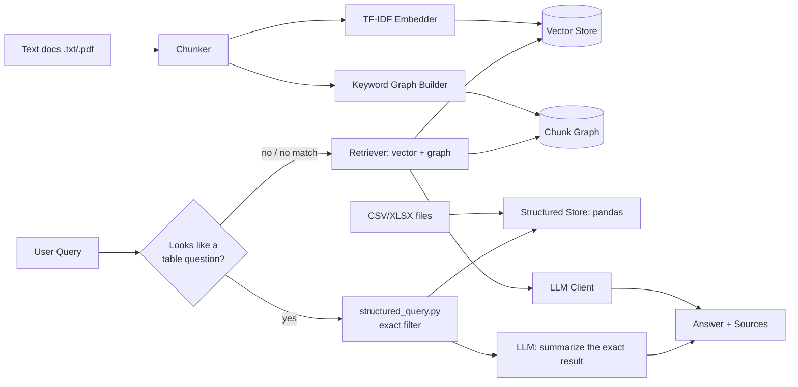

# Graph-Lite RAG Agent

A small, self-contained Retrieval-Augmented Generation agent you can run on
your laptop in a minute — no Neo4j, no GPU, no paid API key required to try it.

It's inspired by the **Medical-Graph-RAG** architecture (hierarchical
graph-linked retrieval over documents), simplified so it runs on any machine
with plain Python:

| Medical-Graph-RAG                               | This project                                   |
|---------------------------------------------------|-------------------------------------------------|
| Neo4j graph database                              | In-memory graph (`networkx`), no server to run  |
| UMLS medical ontology + hierarchy linking         | Keyword-overlap graph linking between chunks    |
| CAMEL multi-agent framework                        | One `RAGAgent` class, ~150 lines                |
| OpenAI embeddings (required)                      | TF-IDF by default; OpenAI/Anthropic optional    |
| Needs MIMIC-IV / UMLS access to even start        | Works offline, out of the box, on any documents |

The idea it keeps: retrieval isn't *just* "top-k nearest vectors." Chunks that
share meaningful terms are linked in a graph, so when a query hits one chunk,
its graph neighbors (related context elsewhere in the corpus) get pulled in
too — the same "neighbor expansion" trick the original repo uses, just
without Neo4j.

## Two kinds of data, two different answer engines

This project deliberately does NOT run spreadsheets through the same
similarity-search pipeline as prose documents. That combination is a common
RAG mistake: TF-IDF/embedding similarity has no real way to do an exact
lookup or a numeric threshold, so it gives a confidently-wrong "closest
match" instead of a real filter.

| Question                                              | Engine used          | How it answers                                   |
|---------------------------------------------------------|----------------------|---------------------------------------------------|
| "What is safety stock?"                                 | Text RAG             | Finds + graph-expands the most relevant passages  |
| "Which SKUs have Quantity below 30"                     | Structured (exact)   | A real pandas filter — `Quantity < 30`            |
| "Tell me about WPB-1004" / an ASIN                      | Structured (exact)   | Exact row lookup by value, any column             |
| "How many SKUs have Status Low"                         | Structured (exact)   | Exact filter + count — never estimated            |
| "Quantity below 30 **and** FC is BLR2"                  | Structured (exact)   | Two conditions combined with AND                  |
| "Status Low **or** Status Stranded"                     | Structured (exact)   | Two conditions combined with OR                   |
| "What is the **total** quantity **by** FC"              | Structured (exact)   | Grouped sum — same for average/max/min            |
| "**Total** quantity of SKUs **with** Status Low"        | Structured (exact)   | Aggregation applied to a filtered subset          |
| "Which SKUs have **stock on hand** below 10"             | Structured (exact)   | Synonym match to a column literally named "Qty Avail" |
| "Which SKUs are **below their Reorder Point**"           | Structured (exact)   | Column-vs-column comparison, no fixed number at all |

The agent tries the exact-match path first whenever a spreadsheet has been
ingested; it only falls back to text retrieval when the question doesn't
match a recognizable column/value/comparison pattern.

## Architecture



## Quick start

```bash
pip install -r requirements.txt

# 1. Ingest text docs (prose: SOPs, glossaries, policy docs)
python cli.py ingest-docs --docs sample_docs

# 2. Ingest spreadsheets (CSV/XLSX: inventory, orders, anything row-based)
python cli.py ingest-data --files sample_data

# 3. Ask a question — works with NO api key, "offline mode" shows the exact
#    filter result or best-matching passages instead of generated prose
python cli.py ask "Which SKUs have Quantity below 30"
python cli.py ask "What is safety stock and why does it matter?"

# 4. Optional: turn on real generation (a plain-English sentence wrapped
#    around the exact result, for the table path; a written answer for text)
export OPENAI_API_KEY=sk-...      # or ANTHROPIC_API_KEY=sk-ant-...

# 5. Optional: web chat UI
python app.py          # then open http://localhost:5000
```

## Live file upload (no terminal needed)

The web UI has two upload controls — no CLI, no redeploy, either one:

- **"+ Upload CSV/XLSX"** — a spreadsheet. This **replaces** any previously
  loaded spreadsheet (text docs in `sample_docs` are untouched either way).
  That's deliberate: once someone hands you a real data file, every
  question should answer from that file, not get silently picked up by
  leftover demo data with a similarly-named column. If you want the
  original sample data back, re-run `ingest-data --files sample_data` from
  the CLI, or restart the app if you ingested via CLI beforehand (that
  index is still on disk).
- **"+ Upload PDF/DOCX/TXT"** — a text document. This **adds** to the
  existing text corpus rather than replacing it — a new policy doc or
  report is meant to supplement a knowledge base, not wipe it out, and
  (unlike spreadsheets) there's no "wrong table" collision risk: a text
  question can legitimately draw on several documents at once, which is
  the whole point of the graph-linking. Under the hood, TF-IDF has to be
  refit on the whole corpus to add a document — there's no clean way to
  add one file to an already-fitted vectorizer — so this reconstructs
  every existing chunk from the vector store's own metadata, adds the new
  file's chunks, and rebuilds. Fine at this corpus size; a much larger
  one would need a different approach.

## Charts for grouped data

Any grouped aggregation ("average X by Y") returns an actual bar chart
(a base64 PNG, rendered server-side with matplotlib) alongside the exact
numbers — not instead of them. A plain, non-grouped number ("total X")
correctly returns no chart, since there's nothing to plot. The chart is
additive: offline mode, the CLI, and any caller that ignores it still get
the complete, correct text answer either way.

## Project layout

```
rag_agent/
├── chunker.py           # splits raw docs into overlapping chunks
├── embedder.py          # TF-IDF vectors (no download, no API needed)
├── graph_builder.py     # links chunks that share top keywords
├── vector_store.py      # cosine-similarity search over chunk vectors
├── retriever.py         # vector search + one-hop graph expansion
├── structured_store.py  # loads CSV/XLSX into pandas DataFrames
├── structured_query.py  # plain-English -> exact pandas filter (no fuzziness)
├── llm_client.py        # pluggable: OpenAI / Anthropic / offline stub
├── agent.py             # RAGAgent — routes a query to the right engine
├── cli.py               # terminal interface
├── app.py               # minimal Flask chat UI
├── eval.py              # 14 verified question/answer pairs — run after any change
├── sample_docs/         # 8 e-commerce business documents: 1P/3P/DTC models,
│                        #   catalog management, brand contracts & onboarding,
│                        #   P&L economics, supply chain ops end-to-end, and a
│                        #   document explicitly linking catalog decisions to
│                        #   supply chain outcomes (see below)
├── sample_data/         # two demo tables: a tiny CSV + a 90-row synthetic
│                        #   FBA export (27 columns, real export structure,
│                        #   fully invented SKUs/ASINs/numbers — see below)
└── data/                # persisted indexes (created after you run ingest)
```

## Swapping in your own files

```bash
python cli.py ingest-docs --docs /path/to/your/text/folder
python cli.py ingest-data --files /path/to/your/spreadsheet/folder
```

A natural next step for this as a portfolio piece: point `ingest-docs` at
your Pattern SOPs or the supply-chain glossary from your mastery roadmap,
and `ingest-data` at a real (sanitized) inventory or order export, then
demo both kinds of question side by side.

## What the text corpus actually covers

Beyond the original three files, `sample_docs/` now covers the commercial
side through to the operational side of running an e-commerce brand:

- **`ecommerce_business_models.txt`** — 1P (Vendor Central), 3P (Seller
  Central/marketplace), and DTC, with the margin and control trade-offs of each
- **`catalog_management.txt`** — the ASIN lifecycle, flat files, content
  quality's effect on conversion/ranking, variation mapping, stranded inventory
- **`brand_contracts_onboarding.txt`** — commission/retainer/wholesale
  contract structures, a 5-stage onboarding sequence (intake → data/PIM
  setup → inventory/PO handoff → pricing → reporting/escalation) with real
  timelines (2-3 months end to end, compliance approval as the actual
  critical path for new-market launches), and why skipping the audit step
  causes new engagements to inherit blame for pre-existing problems. The
  process structure here was informed by a real internal onboarding
  playbook — generic staging and timelines only, no Pattern-specific
  commercial terms or tool names
- **`ecommerce_pnl.txt`** — the full P&L waterfall (gross revenue → COGS →
  marketplace fees → ad spend → contribution margin → management fee), and
  why contribution margin, not gross margin, should drive SKU decisions
- **`supply_chain_operations.txt`** — demand planning → procurement →
  inbound logistics → warehousing/fulfillment → reverse logistics, as one
  connected chain where failures surface downstream, not where they started
- **`catalog_supply_chain_connection.txt`** — written specifically to
  connect the commercial/catalog documents to the supply chain documents:
  how a stranded listing quietly corrupts a demand forecast, how variation
  errors split demand signal, why a velocity drop should be checked against
  listing status before any inventory action
- **`advertising_and_pricing.txt`** — Sponsored Products/Brands/DSP, ACoS
  vs. TACoS, the bid-harvesting cycle, and how pricing and ad-bid decisions
  made without a shared contribution-margin view silently erode profitability
- **`customer_experience_returns.txt`** — account health metrics (ODR, VOC),
  compliant review-management rules, the customer-facing return policy vs.
  the operational reverse-logistics process as two different things, and
  complaint escalation tiers
- **`multichannel_and_compliance.txt`** — Walmart Marketplace and WFS,
  TikTok Shop's spikier demand model, DTC storefront ownership trade-offs,
  and cross-border VAT/US sales-tax obligations that persist independently
  of any single marketplace's own rules

This set now genuinely spans commercial model → catalog → contracts/
onboarding → advertising/pricing → customer experience → supply chain →
multi-channel/compliance — a real commercial-to-supply-chain arc, though
still not "every function of e-commerce" in the broadest possible sense
(no deep HR/team-structure content, no UX/design content). Worth naming
accurately rather than oversold.

This is real, substantive domain content (not filler), and it's the reason
the graph-linking feature actually has something to demonstrate: ask "what
causes stranded inventory and how does it affect forecasting" and the
agent pulls `catalog_management.txt` (the root cause) and
`catalog_supply_chain_connection.txt` (the downstream consequence) together
in one answer — two different files, connected because they share
meaningful terms, not because anyone pre-linked them by hand.

One honest limitation surfaced while testing this: TF-IDF ranks by literal
term overlap, so a question like "explain the 3P model" can occasionally
rank a tangentially-related chunk above the actual explainer, if that
chunk happens to repeat a generic word (here, "model") more densely than
the relevant chunk repeats the specific term ("3P"). The correct content
still surfaces — it's in the sources, just not always ranked first — and
this is exactly the kind of gap a neural embedding model would close if
retrieval quality needs to go further (see "Notes on scope" below).

## Why there's a second, bigger demo table

`sample_data/fba_inventory_detailed.xlsx` mirrors the structure of a real
Amazon Seller Central restock report — 90 rows, 27 columns (SKU, ASIN,
velocity, reorder math, stockout risk, margins, projections), including the
merged two-row header a real export actually has. Every value in it is
randomly generated (`gen_synthetic_inventory.py`) — no real SKU, ASIN,
product name, or business figure from anyone's actual inventory is in this
file or was used to derive it. It exists so a live demo shows the agent
handling realistic shape and scale, without publishing real business data
to a public repo.

The multi-level header detection in `structured_store.py` exists because of
this: a real FBA-style export's top row is a merged group label ("Inventory
(units)" spanning several real column names in the row below it), and a
naive `pd.read_excel()` would silently misread those group labels as the
column names. It's auto-detected and corrected — this isn't specific to the
sample file, it'll handle the same pattern in a real export too.

If you later swap in your own real spreadsheet, keep it out of the GitHub
repo (add it to `.gitignore`) rather than replacing this demo file, so
nothing proprietary ends up in a public deployment.

## What the structured query parser actually understands

- **Exact value lookup** — any word in your question that matches a cell
  value anywhere in the table (a SKU, an ASIN, an order ID). Restricted to
  codes containing a digit, or identifier-like columns where every value is
  unique — a plain English word that happens to equal a category value
  (e.g. "stranded") won't hijack an unrelated question.
- **Column + comparison + number** — "below/under/less than", "above/over/
  greater than", "at least", "at most", plus a number
- **Column + categorical value** — "Status Low", "FC BLR2", etc.
- **Column vs. column** — "Available below Reorder Point" — compares two
  columns row-by-row, with no fixed number at all. Needs both columns named
  explicitly; "below their threshold" with no left-hand column named has no
  honest way to know what "their" refers to, so it correctly reports no
  match instead of guessing.
- **Synonyms and abbreviations** (`synonyms.py`) — a bounded, documented
  list of common inventory/e-commerce aliases, so "stock on hand" connects
  to a column literally named "Qty Avail" or "On Hand Units". This is NOT
  general language understanding — only phrases actually in that file
  resolve; anything else still fails honestly. Direct name matches always
  outrank a synonym match, and when several tables are loaded at once, the
  most specific match across ALL of them wins, not just whichever table
  happened to be checked first.
- **AND / OR between two conditions** — "Quantity below 30 and FC is BLR2",
  "Status Low or Status Stranded"
- **Aggregations** — sum/total, average/mean, max, min; optionally grouped
  ("by FC") and optionally combined with a filter ("...of SKUs with Status
  Low")

It says so honestly when a question doesn't match any of these, rather than
guessing. It is still not a text-to-SQL engine: three or more chained
conditions, or mixing AND and OR in one question, aren't supported — see
`eval.py` for exactly what's verified to work.

## Robustness: what happens with a real, unfamiliar file

Tested against (not just assumed to handle):
- **Currency-formatted numbers** ("$1,234.56") — stripped before numeric comparison/aggregation
- **Multiple junk rows above the real header** (a title row, a "Generated: ..." row) — tries up to 5 header rows and picks the first clean one, not just one fixed row down
- **Multi-sheet Excel files** — every sheet is ingested as its own table, not just the first one

Still real gaps, stated plainly rather than hidden:
- Only `.csv` and `.xlsx`/`.xls` — a PDF table, a Google Sheets link, or a screenshot needs converting to one of those first
- Column names must be mentioned close to how they're spelled in the file — "Qty Available" won't match a question about "stock on hand" unless the words actually overlap; it fails honestly (shows the real columns) rather than guessing
- More than 5 junk rows above a header, multiple merged header *rows* (not just one), or a header that itself spans merged *cells* sideways aren't handled

## Checking it actually works: `eval.py`

```bash
python eval.py
```

Runs 17 question → verified-correct-answer pairs against whatever is
currently ingested (text docs + both sample tables) and reports a pass/fail
per case. These aren't throwaway smoke tests — several exist specifically
because an earlier version of this code produced a confidently wrong
answer that only surfaced once something was automatically checking the
actual numbers instead of eyeballing output: an AND filter silently
ignoring one of its two conditions, a plain English word ("stranded")
hijacking an unrelated question because it matched a category value, and
an aggregation picking the wrong table out of several ingested ones because
a column name happened to substring-match the question. Worth running
again any time you touch `structured_query.py` or swap in your own data.

## Deploying it

`app.py` is a plain Flask app, so it deploys anywhere that runs Python
(Render, Railway, Fly.io, an EC2 box) — Netlify itself only serves static
sites/functions, so it's not a fit for this one as-is. If you want a
Netlify-deployable version, the cleanest path is converting `agent.py`'s
`query()` call into a Netlify serverless function and keeping the chat UI as
static HTML that calls it.

## Notes on scope

- TF-IDF is a deliberate choice over a neural embedding model: zero download,
  zero GPU, runs instantly, and is a legitimate retrieval method on its own
  (it's what gives this project its "no heavy infra" property). Swapping in
  OpenAI/Cohere embeddings is a ~10-line change in `embedder.py` if you want
  higher retrieval quality later.
- The "graph" is intentionally simple (keyword overlap, one-hop expansion).
  It is the same *idea* as Medical-Graph-RAG's hierarchy linking, not a port
  of its implementation.
